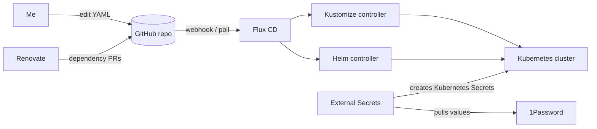
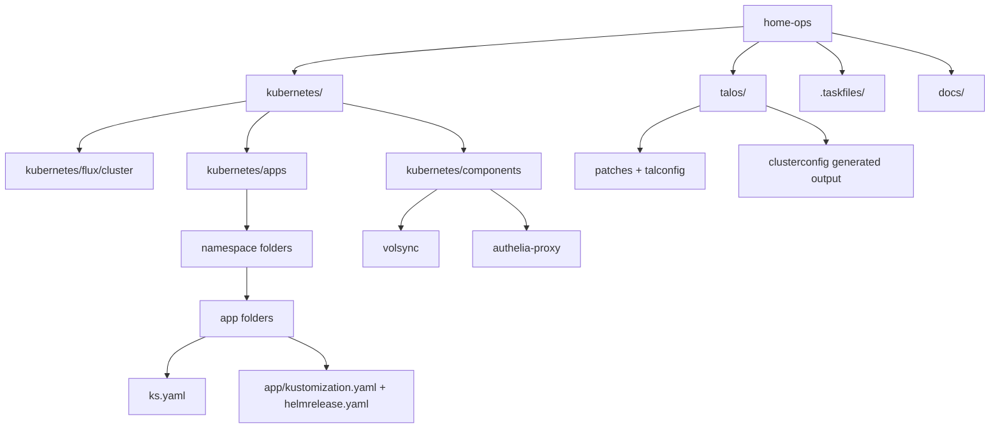
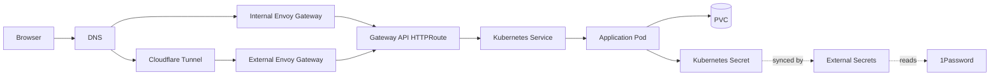

+++
title = "A Tour of My home-ops Repository"
date = 2026-05-27T00:00:00+10:00
draft = true
slug = "a-tour-of-my-home-ops-repository"
tags = ["homelab", "kubernetes", "gitops"]
+++

My house runs on a Kubernetes cluster.

That sentence is either delightful or absurd, depending on how much time you have spent around home labs. For me, it is both. The point of my `home-ops` repository is not just to run a few apps at home; it is to make the whole system understandable, repeatable, and recoverable. If I need to remember how something works, rebuild a node, restore an app, or answer "why is this service exposed that way?", the answer should be in Git.

This post is a first-principles tour of the repository: what lives where, how a change turns into a running workload, how secrets and storage are handled, and what I have learned from treating a home network a little like a tiny production platform.

<!--more-->

## The short version

`home-ops` is the source of truth for a five-node bare-metal Kubernetes cluster running at home. The major pieces are:

- **Talos Linux** for immutable, API-driven Kubernetes nodes.
- **Flux CD** for GitOps reconciliation.
- **HelmRelease + Kustomize** for application deployment.
- **1Password External Secrets and SOPS** for secret material.
- **Rook-Ceph, OpenEBS, VolSync, and Kopia** for storage and backups.
- **Cilium, Envoy Gateway, Gateway API, ExternalDNS, and Cloudflare Tunnel** for networking and routing.
- **Renovate** for automated dependency updates.

The mental model is simple: I edit YAML, push it, and Flux reconciles the cluster toward the declared state.



## Repository map

At the top level, the repository is intentionally boring. Most of the interesting material is under `kubernetes/`, with Talos configuration and operational documentation beside it.

```text
home-ops/
├── kubernetes/
│   ├── apps/
│   ├── components/
│   └── flux/
├── talos/
├── .taskfiles/
├── docs/
├── scripts/
├── Taskfile.yaml
└── README.md
```

In diagram form:



The important convention is that applications follow a repeatable shape:

```text
kubernetes/apps/<namespace>/<app>/
├── ks.yaml
└── app/
    ├── kustomization.yaml
    ├── helmrelease.yaml
    └── externalsecret.yaml        # when needed
```

`ks.yaml` is the Flux `Kustomization` that tells Flux where the app lives, what namespace to target, what it depends on, and whether to prune resources that disappear from Git. The `app/` directory then contains the resources for that app, usually a HelmRelease using the shared `app-template` chart.

## The cluster layer: Talos as the base

The cluster runs on five bare-metal nodes: three control-plane nodes and two workers. Talos Linux keeps the node operating system deliberately small and declarative. Instead of SSHing into boxes and hand-editing files, node configuration is generated from the Talos inputs in the repository.

The main rule is: do not hand-edit generated cluster config. The editable pieces live in Talos source files and patches; generated output lives under `talos/clusterconfig/`. That separation matters because generated files are easy to recreate, but hand edits are easy to forget.

This is a recurring theme in the repo: the bits humans should edit are kept distinct from generated or reconciled output.

## Flux: the deployment pipeline is the repo

Flux starts from `kubernetes/flux/cluster/ks.yaml`, which points at `./kubernetes/apps`. That gives Flux the top-level entry point for all cluster applications.

A simplified version of the flow looks like this:

1. Flux watches the Git repository.
2. The cluster-level Kustomization points Flux at `kubernetes/apps`.
3. Namespace-level `kustomization.yaml` files include app `ks.yaml` files.
4. Each app `ks.yaml` points at its own `app/` directory.
5. The app directory renders resources such as HelmRelease, ExternalSecret, routes, and supporting config.
6. Flux applies the rendered state to the cluster.

The useful part is not that this is fancy. It is that it is inspectable. If an app exists, I can usually answer these questions by reading a few files:

- What namespace is it in?
- What image and digest is it running?
- Does it have persistent storage?
- What secrets does it expect?
- Is it exposed internally, externally, or not at all?
- What does it depend on?
- What happens if I remove it from Git?

That last question is not theoretical. Many Flux Kustomizations use `prune: true`, so deleting a manifest from Git can delete the live resource. That is great for drift control and dangerous if you are casual.

## Applications: one pattern, many services

The repository hosts a mix of home automation, media, productivity, observability, networking, and platform services. The exact list changes over time, but the shape is consistent.

For example, `actual-budget` lives at:

```text
kubernetes/apps/default/actual-budget/
├── ks.yaml
└── app/
    ├── externalsecret.yaml
    ├── helmrelease.yaml
    └── kustomization.yaml
```

Its `ks.yaml` says, roughly:

- target the `default` namespace;
- use the reusable VolSync component;
- depend on the Rook-Ceph cluster;
- render `./kubernetes/apps/default/actual-budget/app`;
- substitute app-specific backup settings.

The HelmRelease then declares the container image, environment variables, probes, resources, security context, service, route, and persistence. A nice property of this style is that app-specific details are close together. The deployment is not split across a dozen places unless there is a reusable reason for it.

A typical app has a few responsibilities:

- **Runtime:** what image to run, with tag and digest.
- **Configuration:** environment variables, ConfigMaps, and app chart values.
- **Security:** non-root user, dropped capabilities, read-only root filesystem where possible.
- **Networking:** service ports and Gateway API routes.
- **Persistence:** PVCs, existing claims, and backup policy.
- **Secrets:** references to Kubernetes Secrets created by External Secrets.

This makes onboarding a new app mostly an exercise in copying a known-good shape and changing the specifics.

## Secrets: references in Git, values elsewhere

Secrets are where a GitOps repo can go very wrong. The rule in this repo is that plaintext secret values do not belong in Git.

There are two main mechanisms:

- **External Secrets + 1Password** for application secrets and credentials.
- **SOPS** for files that are intentionally encrypted in the repository.

For many apps, the repository stores an `ExternalSecret` that says which 1Password item to read and what Kubernetes Secret to create. The secret value itself remains outside the repository.

That gives a useful balance: the shape of the secret is documented in Git, while the sensitive material stays in a secrets manager.

For example, an app can declare that it needs an OAuth client secret from the `authelia` item in 1Password, but the actual secret value never appears in the repo.

## Networking: internal, external, and protected routes

Networking is one of the places where the repository earns its keep. There are internal services for the house, public services that come through Cloudflare, and protected services sitting behind Authelia.

The main building blocks are:

- **Cilium** for cluster networking.
- **Envoy Gateway** for Gateway API-based routing.
- **HTTPRoute** resources rather than legacy Ingress.
- **ExternalDNS** for DNS record management.
- **Cloudflare Tunnel** for public exposure without opening the network directly.
- **Authelia** for authentication in front of selected apps.

A request path usually looks something like this:



The distinction between internal and external routes is important. Some apps are only useful inside the house. Some are safe to expose publicly through Cloudflare and authentication. Some should never have a route at all.

Because routes live with app configuration, exposure is reviewable. If a service becomes public, that change appears in Git.

## Storage and backups: state is the hard part

Stateless apps are easy. Stateful apps are where a home cluster starts feeling real.

This repo uses a few layers:

- **Rook-Ceph** for distributed storage.
- **OpenEBS** for local persistent volumes where appropriate.
- **VolSync** for volume replication and backup workflows.
- **Kopia** as part of the backup story.

Persistent apps often include the reusable VolSync component from `kubernetes/components/volsync`. App-level substitutions define the app name, capacity, and schedules. That keeps backup boilerplate out of every app while still making backup intent visible per workload.

The practical lesson: a backup system is not a backup system until you have practiced restoring from it. GitOps makes it easier to recreate resources, but it does not magically recreate application data. The repository can declare PVCs and replication policies; I still need operational discipline around restore tests.

## Automation and maintenance

A home platform accrues chores. Dependency updates, cluster upgrades, certificate renewals, backup checks, image digests, and schema changes all need attention.

The repo handles some of that with:

- **Renovate** for image, chart, and dependency update PRs.
- **Taskfiles** for repeatable operational commands.
- **Schema comments** on YAML where possible, so editors and validators know what each file should look like.
- **Docs under `docs/`** for operations such as bootstrapping, upgrades, node replacement, and shutdown.

This is less glamorous than the app list, but it is what keeps the setup maintainable. Future me is the primary operator, and future me does not remember clever one-off commands.

## A concrete walkthrough: Actual Budget

To make the flow less abstract, here is how one app is represented.

`actual-budget` is declared under `kubernetes/apps/default/actual-budget`. The Flux Kustomization at `ks.yaml` targets the `default` namespace and includes the VolSync component. That means the app gets a PVC and backup/replication resources from the shared component.

The app-level `kustomization.yaml` includes:

```text
helmrelease.yaml
externalsecret.yaml
```

The `externalsecret.yaml` tells External Secrets to read from 1Password and create a Kubernetes Secret for the app. The HelmRelease references that secret via `envFrom`, so the container receives the values at runtime without the values appearing in Git.

The HelmRelease also declares:

- the immutable container image reference;
- non-root runtime settings;
- health probes;
- resource requests and limits;
- an HTTP service on the app port;
- a Gateway API route on the internal Envoy gateway;
- a persistent data mount backed by the app PVC.

So the path from Git to running service is:

```text
ks.yaml
  -> app/kustomization.yaml
    -> helmrelease.yaml
    -> externalsecret.yaml
  -> Flux reconciliation
  -> Helm release
  -> Pod + Service + Route + Secret + PVC
```

That is the pattern repeated across the repo.

## What I like about this setup

The biggest win is not automation. It is legibility.

When something breaks, I have a map. When I add a new app, I have examples. When I wonder why something is reachable from the internet, I can inspect the route. When Renovate opens a dependency update, I can reason about the blast radius from the app boundary and dependency chain.

A few design choices have paid off repeatedly:

- Keep app directories boring and consistent.
- Put operational docs near the code.
- Use reusable Kustomize components for cross-cutting concerns like backups and auth proxying.
- Prefer Gateway API routes over ad hoc ingress patterns.
- Make secret references visible, but keep secret values elsewhere.
- Treat generated files as generated files.

## What still hurts

Kubernetes at home is still Kubernetes. There are trade-offs.

- There are many moving parts for a house.
- Stateful restores need regular practice.
- GitOps makes drift visible, but it can also delete exactly what you told it to delete.
- Dependency updates are easier with Renovate, but not risk-free.
- Every abstraction eventually leaks at 11 pm.

The repository helps because it turns many problems into reading problems before they become debugging problems. But it does not remove the need to understand the system.

## What I would improve next

A few areas I would like to keep improving:

- More automated validation for app conventions.
- Better disaster recovery runbooks and restore drills.
- Clearer diagrams for network paths and trust boundaries.
- More policy enforcement around security context and image references.
- A simpler new-app template so app onboarding is even more mechanical.

## Closing thoughts

`home-ops` is part infrastructure, part documentation, part lab notebook. It is the executable map of how my home platform works.

That is the real value of GitOps for me. Not just that the cluster reconciles automatically, but that the desired state is written down in a way I can review, diff, copy, improve, and recover from.

Is Kubernetes overkill for a home? Absolutely.

Is it a useful way to learn how production-shaped systems behave when they are also responsible for your lights, documents, media, and budget? Also absolutely.
